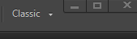
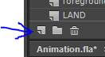
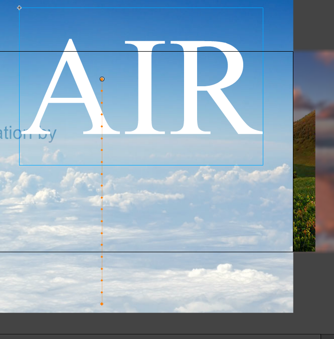
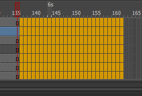

# Adobe Animate - motion path

* Click classic view

* Slide the timeline marker to view animation
* Click menu option "Control" > "Test" to view animation

* Click Sea layer so it's active
* Create new Layer > name it 'sky'
* Right click sky's frame #110 and Insert keyframe 

* File > Import > Import to Stage > Sky.jpg > Slide image up
* Click Air layer so it's active
* Right click Air layer > Create Motion Tween
* Click Air's beginning keyframe point so it's active
* Drag the text 'Air' downward off screen 
* Scrub to frame #130 - Drag Air upward on screen - you should see orange line/path left behind

* Bend line by hovering mouse over orange line until curve cursor shows then drag it right
* Scrub or Ctrl+Enter to preview

* Add some more keyframes by dragging area to the right of all frames > right clicking that area > Insert Frame

* Scrub to frame #145 - Drag Air upward again
* Bend line again
* Preview it

